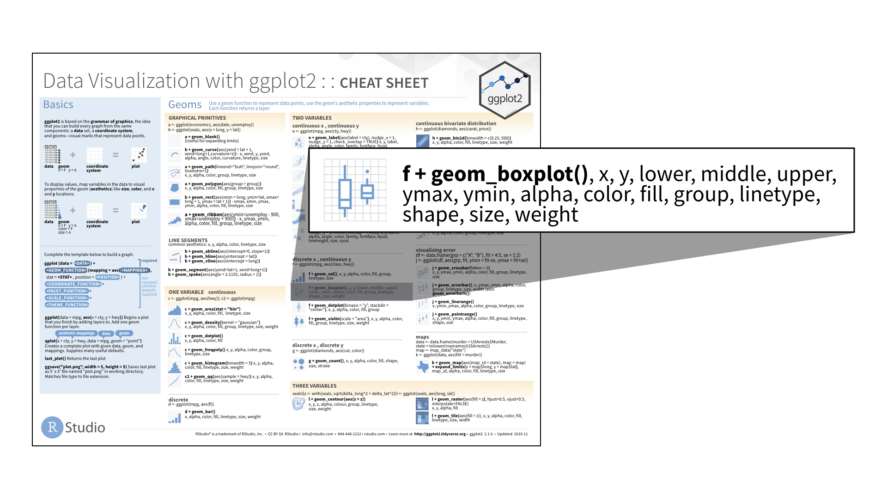

```{r setup, include=FALSE}
library(learnr)
library(ggplot2)

checker <- function(label, user_code, check_code, envir_result, evaluate_result, ...) 
  list(message = check_code, correct = TRUE, location = "append")

tutorial_options(exercise.timelimit = 60, exercise.checker = checker)
knitr::opts_chunk$set(error = TRUE, out.width = "100%")
```


## Introduction

### \t 

Boxplots are a great way to compare distributions, spot outliers, and visualize skewedness.

## How to make a boxplot

### \t

You can make a boxplot with the `boxplot()` function:

```{r out.width = "90%"}
boxplot(Sepal.Length ~ Species, data = iris)
```

### \t

Or with the **ggplot2** package:

```{r echo = FALSE, out.width="90%"}

```

### \t

Let's learn how.


## Exercises

### Exercise 1 - Boxplots

```{r echo = FALSE, out.width="70%"}
knitr::include_graphics("www/images/box-png.png")
```

```{r r1, echo = FALSE}
question("Which of the sub-plots accurately describes the data above with a boxplot?",
         answer("A", message = "Good try, but this is tricky. The middle of this box is near the middle of the range of the data, but it is not the median. The median depends on how many observations are on each side of the value."  ),
         answer("B", message = "This box extends the entire range of the data. This could be a useful plot (ggplot2 calls it a crossbar) but it is not a boxplot"),
         answer("C", correct = TRUE),
         allow_retry = TRUE
)
```


### Exercise 2 - Write the code

The `iris` data set contains measurements of `Petal.length` for three `Species` of iris flowers.

* Use `boxplot()` to compare the distributions of petal length for each species. Then click Submit Answer.

```{r boxplot, exercise = TRUE}

```

```{r boxplot-hint-1}
"Begin with the boxplot() function."
```

```{r boxplot-hint-2}
"The first argument of boxplot() should be a formula object."
```

```{r boxplot-hint-3}
"Did you remember to specify which data set to use?"
```

```{r boxplot-solution}
boxplot(Petal.Length ~ Species, data = iris)
```

```{r boxplot-setup}
iris <- tibble::as.tibble(iris)
```

```{r boxplot-check}
"Great Job! Now let's look at how to make boxplots with the ggplot2 package."
```

### Exercise 3 - Finish the code

* Finish the code below to make a graph that uses boxplots to compare the distributions of hwy by class. Then click Submit Answer. 

```{r geom_boxplot, exercise = TRUE}
ggplot(data = mpg, aes(x = class, y = hwy))

```

```{r geom_boxplot-solution}
ggplot(data = mpg, aes(x = class, y = hwy)) +
  geom_boxplot()
```

```{r geom_boxplot-check}
"You are on a roll!"
```

### Exercise 4 - Adapt the code

* Change the previous code to make a _violin plot_. Then click Submit Answer.

```{r geom_violin, exercise = TRUE}
ggplot(data = mpg, aes(x = class, y = hwy)) +
  geom_boxplot()
```

```{r geom_violin-solution}
ggplot(data = mpg, aes(x = class, y = hwy)) +
  geom_violin()
```

```{r geom_violin-check}
"Excellent! Now let's test your ability to fix a boxplot that has gone wrong."
```

### Exercise 5 - Fix the code

In the plot below I attempted to compare the distributions of `cty` by `class`. 

* Determine what went wrong in this plot, then fix it. Click Submit Answer when you are finished.

```{r fix, exercise = TRUE, exercise.eval = TRUE}
ggplot(data = mpg, aes(x = cty, y = class)) +
  geom_boxplot()
```

```{r fix-solution}
ggplot(data = mpg, aes(x = class, y = cty)) +
  geom_boxplot()
```

```{r fix-check}
"Congratulations! You've mastered the boxplot. When you are ready, advance to the next lesson to learn how to plot outside of the box."
```


